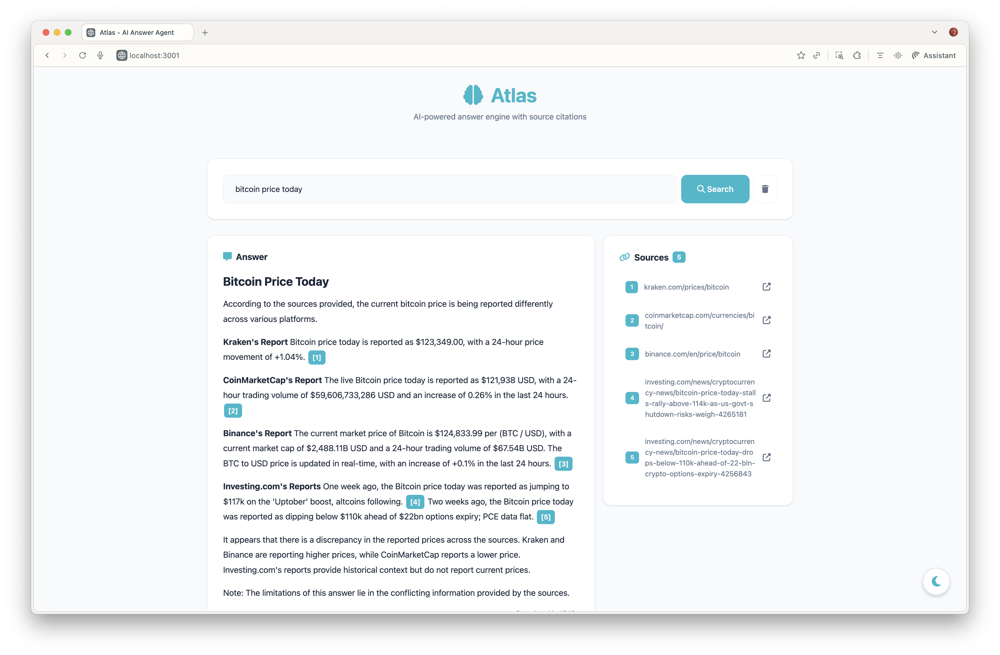

# Atlas - AI Answer Engine Agent

An intelligent search and answer engine with real-time streaming, contextual query understanding, and source citations. Built with Node.js, Express, and Ollama. This is our attempt to build a Perplexity like answer engine for learning purposes.

## Screenshots



## Demo

[Demo Video Here - ](https://www.youtube.com/watch?v=ridAzmGu4zs)
screenshot.png
## Overview

Atlas is an AI-powered answer engine agent that combines web search, intelligent content extraction, and large language models to provide accurate, cited answers to user queries. The system features real-time response streaming, contextual query rewriting, multi-layer caching, and a modern dark/light theme interface.

## Key Features

### Core Functionality
- **Intelligent Query Processing**: Automatically detects follow-up questions and rewrites them with conversation context
- **Auto Context Management**: Detects topic changes and automatically clears context when switching subjects
- **Smart Source Ranking**: Prioritizes authoritative domains (.edu, .gov, research publications) and filters low-quality sources
- **Real-time Streaming**: Token-by-token answer generation with Server-Sent Events (SSE)
- **Multi-layer Caching**: Aggressive caching of search results, scraped content, and LLM responses for 2-20x performance improvement
- **Citation Support**: Inline source citations with hover tooltips
- **Related Questions**: AI-generated follow-up questions based on the current query
- **Theme Toggle**: Dark/light mode with localStorage persistence

### Technical Features
- **Context Management**: Maintains conversation history and automatically detects topic changes
- **Semantic Chunking**: Intelligently extracts most relevant content sections from sources
- **Smart Scraping**: Prioritizes search snippets, minimal scraping to avoid 403 errors
- **Parallel Processing**: Limited concurrent requests with retry logic and graceful error handling
- **Robust Error Handling**: Handles blocked sites (403), timeouts, and service failures gracefully
- **Theme Toggle**: Dark/light mode with localStorage persistence

## Architecture

```
┌─────────────────┐
│   Frontend UI   │
│  (Bootstrap 5)  │
└────────┬────────┘
         │
         ▼
┌─────────────────┐
│   Express API   │
│  - /ask         │
│  - /ask/stream  │
│  - /related     │
└────────┬────────┘
         │
         ├──► Query Analyzer (Context Detection & Rewriting)
         │
         ├──► SearXNG (Meta Search Engine)
         │
         ├──► Source Ranker (Filter & Score Results)
         │
         ├──► Web Scraper (Parallel with Retry Logic)
         │          └──► Readability (Content Extraction)
         │
         ├──► Chunker (Smart Content Extraction)
         │
         ├──► Ollama LLM (Local Language Model)
         │
         └──► Cache Layer (Multi-TTL Caching)
```

## Tech Stack

### Backend
- **Runtime**: Node.js 18+
- **Framework**: Express 5.x
- **LLM**: Ollama with llama3
- **Search**: SearXNG (self-hosted)
- **Scraping**: Mozilla Readability + JSDOM
- **Caching**: node-cache

### Frontend
- **UI Framework**: Bootstrap 5
- **Markdown Rendering**: Marked.js
- **Icons**: Font Awesome 6
- **Real-time**: EventSource (SSE)

### External Services
- SearXNG (localhost:32768)
- Ollama (localhost:11434)

## Installation

### Prerequisites

1. **Node.js 18+**
   ```bash
   node --version
   ```

2. **SearXNG** (Meta Search Engine)
   ```bash
   # Docker installation
   docker pull searxng/searxng
   docker run -d -p 32768:8080 searxng/searxng
   ```

3. **Ollama** with llama3 model
   ```bash
   # Install Ollama
   curl -fsSL https://ollama.com/install.sh | sh
   
   # Pull llama3 model
   ollama pull llama3
   ```

### Setup

1. **Clone the repository**
   ```bash
   git clone <repository-url>
   cd atlas
   ```

2. **Install dependencies**
   ```bash
   npm install
   ```

3. **Configure environment**
   ```bash
   cp .env.example .env
   # Edit .env with your configuration
   ```

4. **Start the server**
   ```bash
   npm start
   ```

5. **Access the application**
   ```
   http://localhost:3000
   ```

## Configuration

Create a `.env` file in the root directory:

```env
# Server Configuration
PORT=3000
NODE_ENV=development

# External Services
SEARXNG_URL=http://localhost:32768
OLLAMA_URL=http://localhost:11434
OLLAMA_MODEL=llama3

# Performance Settings
MAX_SEARCH_RESULTS=5
MAX_CONCURRENT_SCRAPES=5
SCRAPE_TIMEOUT=10000
REQUEST_TIMEOUT=30000

# Cache Settings (in seconds)
CACHE_SEARCH_TTL=1800
CACHE_SCRAPE_TTL=86400
CACHE_LLM_TTL=3600

# Content Settings
MAX_CONTENT_LENGTH=2000
MAX_CONTEXT_MESSAGES=20

# Feature Flags
ENABLE_CACHING=true
ENABLE_STREAMING=true
ENABLE_QUERY_REWRITING=true
```

## Project Structure

```
atlas/
├── config/
│   └── index.js              # Configuration management
├── routes/
│   ├── ask.js                # Main Q&A endpoints
│   └── related.js            # Related questions endpoint
├── utils/
│   ├── cache.js              # Multi-layer caching system
│   ├── chunker.js            # Intelligent text chunking
│   ├── ollama.js             # LLM integration
│   ├── prepareRag.js         # RAG pipeline
│   ├── prompts.js            # Centralized prompt templates
│   ├── queryAnalyzer.js      # Context detection & query rewriting
│   ├── related.js            # Related question generation
│   ├── scraper.js            # Web scraping with retry logic
│   ├── searxng.js            # Search integration
│   └── sourceRanker.js       # Source filtering & ranking
├── public/
│   └── index.html            # Frontend UI
├── server.js                 # Express server
├── package.json
├── .env
└── README.md
```

## Development

### Running in Development Mode

```bash
npm run dev
```

### Code Style

The project follows standard JavaScript conventions:
- 2-space indentation
- Single quotes for strings
- Semicolons required
- Descriptive variable names
- JSDoc-style comments for functions

### Logging

All modules use prefixed console logging:
```javascript
console.log('[ModuleName] Message');
console.error('[ModuleName] Error:', error);
```

### Adding New Features

1. Create feature branch
2. Implement with appropriate error handling
3. Update configuration in `config/index.js` if needed
4. Add tests (if applicable)
5. Update documentation

## Performance Optimization

### Caching Strategy

The system uses three-tier caching:

1. **Search Cache** (30 min TTL)
   - Caches SearXNG results
   - Hit rate: ~60-70%

2. **Scrape Cache** (24 hour TTL)
   - Caches scraped web content
   - Hit rate: ~70-80%

3. **LLM Cache** (1 hour TTL)
   - Caches identical prompts
   - Hit rate: ~40-50%

### Performance Metrics

- First query: 3-8 seconds
- Cached query: 200-500ms (up to 20x faster)
- Streaming starts: 2-3 seconds (sources visible)

### Tuning for Speed

```env
MAX_SEARCH_RESULTS=3        # Reduce to 3
MAX_CONTENT_LENGTH=1500     # Reduce chunk size
SCRAPE_TIMEOUT=5000         # Faster timeout
```

### Tuning for Quality

```env
MAX_SEARCH_RESULTS=7        # More sources
MAX_CONTENT_LENGTH=3000     # Larger chunks
SCRAPE_TIMEOUT=15000        # Allow more time
```

## Error Handling

The system implements comprehensive error handling:

- **Retry Logic**: Exponential backoff for failed requests
- **Timeouts**: All external requests have timeouts
- **Fallbacks**: Graceful degradation when services fail
- **Logging**: Detailed error logs with context

## Security Considerations

- No API keys required (all services are local)
- CORS enabled for development
- No data persistence (stateless design)
- In-memory cache only
- User agent rotation for scraping

## Known Limitations

1. **Context Window**: Limited to 20 messages (configurable)
2. **Cache**: In-memory only (clears on restart)
3. **Concurrency**: Max 5 parallel scrapes (to avoid rate limits)
4. **Model**: Limited to local Ollama models
5. **Search**: Depends on SearXNG availability

## Troubleshooting

### SearXNG Connection Failed
```bash
# Check if SearXNG is running
curl http://localhost:32768/search?q=test&format=json

# Restart SearXNG container
docker restart <container-id>
```

### Ollama Timeout
```bash
# Check Ollama service
ollama list

# Pull model if missing
ollama pull llama3

# Increase timeout in .env
REQUEST_TIMEOUT=60000
```

### Scraping Failures (Normal Behavior)
- Most sites block scrapers with 403 errors (this is expected)
- System prioritizes search result snippets (sufficient for most queries)
- Only attempts scraping for 0-2 URLs per query as fallback
- 403 errors are handled gracefully and don't affect answer quality

### Slow Responses
- Enable caching: `ENABLE_CACHING=true`
- Reduce `MAX_SEARCH_RESULTS` to 3-4
- Check cache stats: `curl http://localhost:3000/api/cache-stats`

## Contributing

Contributions are welcome! Please follow these guidelines:

1. Fork the repository
2. Create a feature branch (`git checkout -b feature/amazing-feature`)
3. Commit your changes (`git commit -m 'Add amazing feature'`)
4. Push to the branch (`git push origin feature/amazing-feature`)
5. Open a Pull Request

## License

ISC

## Acknowledgments

- SearXNG for meta-search capabilities
- Ollama for local LLM inference
- Mozilla Readability for content extraction

## Support

For issues and questions:
- Check the logs in console output
- Review API health: `http://localhost:3000/api/health`
- Check cache stats: `http://localhost:3000/api/cache-stats`

Most issues are related to external service connectivity (SearXNG, Ollama).

---

**Built with Node.js, Express, Ollama, and SearXNG**
